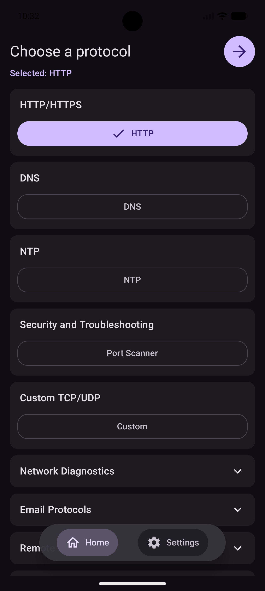
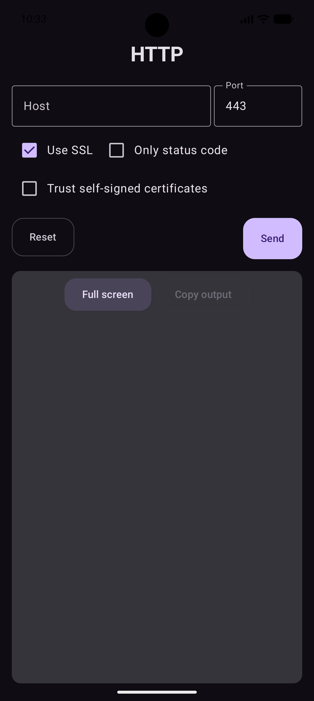
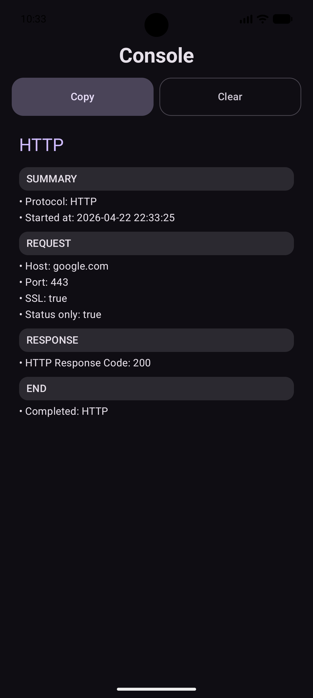

  

  
  
  

<h1 align="center">Multi Protocol Client for Android</h1>

  <em>A modern, versatile Android application that allows interaction with an extensive range of network protocols through an elegant and intuitive Material 3 interface.</em>

## 📱 Screenshots

  <table align="center" style="margin: 0 auto; border: none;">
    <tr>
      <td align="center" style="border: none;">
        
         <b>Protocol Picker</b>
      </td>
      <td align="center" style="border: none;">
        
         <b>Request Builder</b>
      </td>
      <td align="center" style="border: none;">
        
         <b>Console</b>
      </td>
    </tr>
  </table>

  <em>Clean Material 3 design with intuitive protocol-specific controls and a real-time console.</em>

## ✨ Features & Supported Protocols

### 🌐 Web & Naming
* **HTTP/HTTPS**: GET requests, SSL/TLS support, self-signed certificate handling, status code and full response body display.
* **DNS**: Queries over UDP/TCP, DoH (DNS over HTTPS), DoT (DNS over TLS), DoQ (DNS over QUIC). Supports recursion and various record types (A, MX, CNAME, NS, PTR, ANY).

### 🔐 Remote Access & Terminal
* **SSH**: Interactive terminal support with both password and **public key authentication**. Advanced connection handling.
* **Telnet**: Full interactive terminal session handling.

### 🕒 Time & Custom Protocols
* **NTP**: Network Time Protocol with millisecond precision, multi-timezone support, and automatic system detection.
* **Custom TCP/UDP**: Send raw UDP packets or establish custom TCP connections with real-time response monitoring.

### 📊 Network Diagnostics & Tools
* **Diagnostics**: Ping and Traceroute.
* **Network Tools**: Wake-on-LAN (WoL) Magic Packet sender and WHOIS Domain Registrant Lookup.
* **TCP Port Scanner**: Configurable port range and timeout for quick security assessments.

### 📧 Email
* **SMTP** (25/587)
* **POP3** (110/995)
* **IMAP** (143/993)

### 📈 Monitoring & IoT
* **SNMP**: Simple Network Management Protocol v2c.
* **MQTT**: Publish/Subscribe with SSL/TLS support.

### 🚀 Performance Testing
* **iPerf3 & iPerf2**: TCP/UDP clients, reverse mode testing.

### 📁 File Transfer
* **FTP**: Active and Passive modes.
* **SFTP**: Secure File Transfer.
* **TFTP**: UDP Port 69 configuration/file fetcher.

### 🔍 Discovery & Router Management
* **mDNS / Bonjour**: Service discovery by type.
* **SSDP / Discovery**: General network services and device discovery.
* **UPnP**: IGD External IP and router management.

## 🎨 UI/UX Highlights

* **Material 3**: Dynamic theming matching your system colors.
* **Interactive Console**: Real-time logging and terminal emulation for protocols like SSH and Telnet.
* **Formatted Responses**: Easy-to-read structured outputs.
* **Dark/Light Mode**: Full support for your preferred system theme.

## 🔧 Requirements

* Android 8.0 (API level 26) or higher.
* Active Internet/LAN connection.

## 📥 Installation

1. Download the latest release from the GitHub Releases page.
2. Install the APK on your device.
3. Grant the required network permissions when prompted.

## 💡 Quick Start

1. Open the app and use the **Protocol Picker** to select your desired network protocol.
2. Use the **Request Builder** to enter the destination host and configure protocol-specific options (e.g., ports, payload, authentication).
3. Press **"Send"** or **"Connect"** to initiate the request.
4. View the real-time results and interact directly through the **Console**.

## 🤝 Contributing

Pull requests are always welcome! For major changes, please open an issue first to discuss what you would like to improve or add.

---

  ⭐ If you find this project useful, please consider giving it a star on GitHub!

  <em>This application was developed with the assistance of AI tools.</em>

