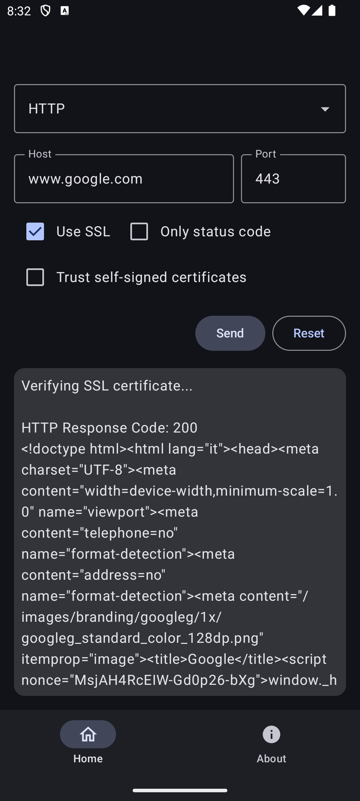

  

  
  
  

<h1 align="center">Multi Protocol Client for Android</h1>

  A modern and versatile Android application that allows interaction with different network protocols through an elegant and intuitive Material You interface.

---

## ✨ Features

### 🔒 HTTP/HTTPS
- GET requests
- SSL/TLS support
- Self-signed certificate handling
- Status code display
- Complete response body

### 🕒 NTP (Network Time Protocol)
- Multiple timezone support
- Automatic system timezone detection
- Millisecond precision

### 🛠 Custom TCP/UDP
- Custom TCP connections
- UDP packets
- Real-time response display

## 🚀 Upcoming Features

### 📡 DNS Management
- DNS queries
- Reverse DNS lookup
- Record lookup (A, MX, TXT)
- DNS over HTTPS

### 📊 Network Diagnostics
- Ping
- Traceroute

### 📧 Email Protocols
- SMTP (25/587)
- POP3 (110/995)
- IMAP (143/993)

### 🔐 Remote Access
- Telnet (23)
- SSH (22)

## 🎨 UI/UX
- Material You design
- Dynamic theming
- Intuitive interface
- Formatted response
- Dark/Light mode

## 🛠 Technologies Used
- Kotlin
- Jetpack Compose
- Material 3

## 📱 Screenshots

  <table align="center" style="margin: 0 auto">
    <tr>
      <td align="center">
        
         
        <em>HTTP/HTTPS</em>
      </td>
      <td align="center">
        
         
        <em>NTP with timezone management</em>
      </td>
      <td align="center">
        
         
        <em>Custom TCP/UDP connections</em>
      </td>
    </tr>
  </table>

  <em>Clean Material You design with intuitive protocol-specific controls</em>

## 🔧 Requirements
- Android 8.0 (API level 26) or higher
- Internet connection

## 📥 Installation
1. Download the latest release from GitHub
2. Install the APK on your device
3. Grant required network permissions

## 💡 How to Use
1. Select desired protocol
2. Enter destination host
3. Configure protocol-specific options
4. Press "Send" to send request
5. View response in dedicated area

## 🤝 Contributing
Pull requests are welcome. For major changes, please open an issue first to discuss what you would like to change.

---

⭐ If you like this project, give it a star on GitHub!
